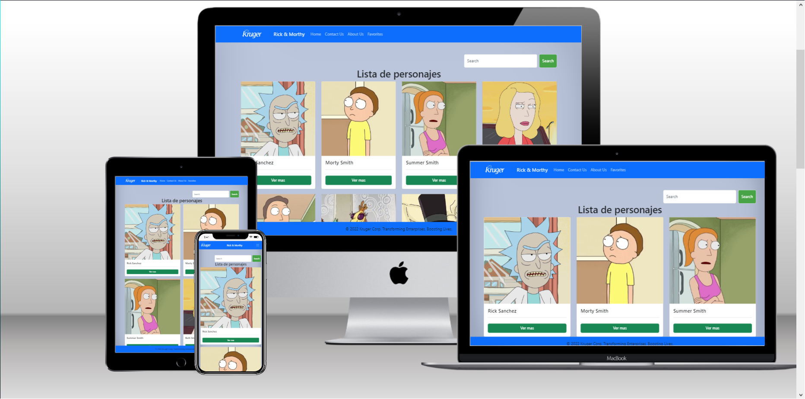

# Kruger Start Proyecto de Front-End

 > En este proyecto se ponen en pratica los temas revisados durante el curso de Front-End.

## Funcionamiento

  - [Video del Funcionamiento](https://www.youtube.com/watch?v=KYR1tryOyyE)

 

## Build with 

 - JS
 - React
 - Axios
 - Redux-Toolkit
 - Netlify
 - HTML y CSS
 - React-Bootstrap

## Live Demo

 [Live Demo Link](https://zippy-granita-c83af5.netlify.app)

## Run it Locally

 ### Setup
 
  - Clone this repo using `git clone https://github.com/Alex-Junior-Solorzano/Proyecto-Front`

  - Go the proyect folder, open a terminal and following commands

 ### Comands

  - To install all packages

    `npm i`

  - To run app

    `npm start`

## Authors

 👤 **Alex Junior Solorzano**

 - GitHub: [@Alex-Junior-Solorzano](https://github.com/Alex-Junior-Solorzano)
 - Linkedin [@Alex Solórzano Vélez](https://www.linkedin.com/in/alex-solórzano-vélez/)

 👤 **Edwin Pinchao**

 - GitHub: [@Edwin9226](https://github.com/Edwin9226)
 - Linkedin [@Edwin Pinchao Mueses](https://www.linkedin.com/in/edwin-pinchao-mueses-951130175/)
